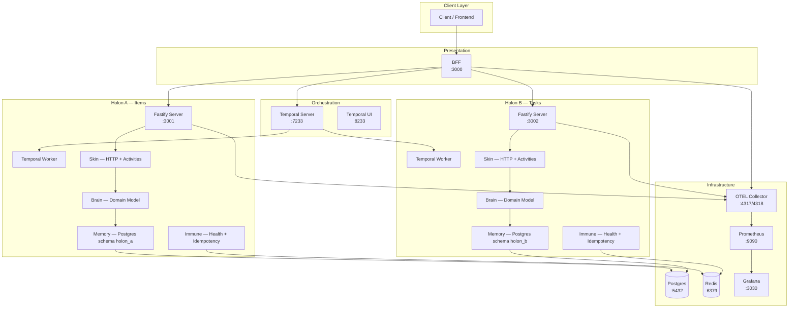

# Holonomic Architecture

Monorepo boilerplate implementing **holonomic systems** principles from "The Whole and the Part" (O Todo e a Parte). Each service is a **holon** — simultaneously autonomous and integrated — with 4 anatomical layers, CQRS, event sourcing, and cross-holon orchestration via Temporal.

> **Holon** (from Greek *holos* "whole" + *-on* "part"): an entity that is both a self-contained whole and a dependent part of a larger system.

## Architecture



## Quick Start

```bash
# Clone and start everything
git clone https://github.com/your-user/holonomic-architecture.git
cd holonomic-architecture

# Start all infrastructure + services
docker compose up -d

# Verify
curl http://localhost:3000/health/live   # BFF
curl http://localhost:3001/health/live   # Holon A
curl http://localhost:3002/health/live   # Holon B
open http://localhost:8233               # Temporal UI
open http://localhost:3030               # Grafana (admin/admin)
```

## The 4 Anatomical Layers

Each holon follows the same internal anatomy, mapped from biological systems:

| Layer | Folder | Responsibility | Analogy |
|-------|--------|---------------|---------|
| **Skin** | `skin/` | Public interface — HTTP routes, Temporal activities | Cell membrane: controls what enters and exits |
| **Brain** | `brain/` | Domain logic — entities, services, ports | Nucleus: decision-making, business rules |
| **Memory** | `memory/` | Persistence — repositories, event store | DNA: stores and retrieves state |
| **Immune** | `immune/` | Self-regulation — health checks, idempotency | Immune system: protects integrity |

```
holons/holon-a/src/
├── skin/              # Layer 1: Interface
│   ├── http/          # REST routes (driving adapter)
│   └── temporal/      # Temporal activities (driving adapter)
├── brain/             # Layer 2: Domain
│   ├── model/         # Entities + value objects
│   ├── service/       # Domain services (Effect programs)
│   ├── port/          # Port interfaces (Context.Tag)
│   └── event/         # Domain event constructors
├── memory/            # Layer 3: Persistence
│   ├── repository/    # Driven adapter (Postgres)
│   ├── event-store/   # Append-only event store
│   └── migration/     # SQL migrations
└── immune/            # Layer 4: Self-Regulation
    ├── health.ts      # Liveness + readiness probes
    └── idempotency.ts # Idempotency guard (Redis)
```

## Temporal Orchestration

All inter-holon communication goes through **Temporal workflows** — no direct holon-to-holon calls.

### Cross-Holon Saga

```
1. BFF receives request → starts Temporal workflow
2. Workflow calls createItemActivity on Holon A (task queue: holon-a-queue)
3. Workflow calls createTaskActivity on Holon B (task queue: holon-b-queue)
4. If Holon B fails → compensateItemActivity on Holon A (automatic rollback)
5. Result returned to BFF via workflow completion
```

Temporal provides: retry policies, timeouts, heartbeats, and exactly-once execution guarantees — eliminating the need for a separate message broker.

## Holonomic Principles → Code

| Principle | Implementation |
|-----------|---------------|
| **Janus Effect** (autonomy + integration) | Each holon has its own Postgres schema + integrates via Temporal workflows |
| **4 Anatomical Layers** | Explicit folder structure: skin/brain/memory/immune |
| **Law of Imports** | Holons never import from each other — only from `@holonomic/shared` |
| **Native Resilience** | Temporal: retry, timeout, compensation, heartbeat built-in |
| **Holistic Observability** | OpenTelemetry traces + metrics across all layers |
| **CQRS + Event Sourcing** | Separate command/query handlers, append-only event store |
| **Idempotency** | Redis-backed idempotency keys on all write operations |
| **Saga Orchestration** | Temporal workflows with automatic compensation |
| **Parse Don't Validate** | Effect Schema at boundary, branded types internally |
| **Functional Core / Imperative Shell** | Pure Effect programs in brain, side effects in skin/memory |
| **Screaming Architecture** | Folders scream domain (skin/brain/memory/immune), not framework |

## API Endpoints

### BFF (`:3000`)

| Method | Path | Description |
|--------|------|-------------|
| `GET` | `/health/live` | Liveness probe |
| `GET` | `/health/ready` | Readiness probe (checks Redis) |
| `GET` | `/aggregate/:itemId/:taskId` | Aggregates data from both holons |
| `POST` | `/saga` | Starts cross-holon saga workflow |
| `POST` | `/sync` | Starts sync workflow |
| `GET` | `/workflow/:workflowId` | Checks workflow status |

### Holon A — Items (`:3001`)

| Method | Path | Description |
|--------|------|-------------|
| `GET` | `/health/live` | Liveness probe |
| `GET` | `/health/ready` | Readiness probe |
| `POST` | `/items` | Create item |
| `GET` | `/items/:id` | Get item by ID |
| `PUT` | `/items/:id` | Update item |
| `DELETE` | `/items/:id` | Delete item |

### Holon B — Tasks (`:3002`)

| Method | Path | Description |
|--------|------|-------------|
| `GET` | `/health/live` | Liveness probe |
| `GET` | `/health/ready` | Readiness probe |
| `POST` | `/tasks` | Create task |
| `GET` | `/tasks/:id` | Get task by ID |
| `POST` | `/tasks/:id/complete` | Complete task |
| `DELETE` | `/tasks/:id` | Cancel task |

## Technology Stack

| Component | Technology | Why |
|-----------|-----------|-----|
| Runtime | Node.js 20 | LTS, native fetch, stable |
| Language | TypeScript (strict) | Type safety, branded types |
| Effect System | Effect-TS | Typed errors, DI via Context.Tag/Layer, concurrency |
| HTTP Framework | Fastify | Performance, schema validation, plugins |
| Orchestration | Temporal | Workflows, sagas, retry, compensation |
| Database | PostgreSQL 16 | Schemas per holon, JSONB for events |
| Cache | Redis 7 | Idempotency keys, rate limiting |
| Observability | OpenTelemetry | Vendor-neutral traces + metrics |
| Metrics | Prometheus | Time-series storage |
| Dashboards | Grafana | Pre-configured holonomic overview |
| Monorepo | pnpm workspaces | Fast, disk-efficient |
| Containers | Docker Compose | Local development, full stack |

## Database Strategy

Single Postgres instance with **schema-per-holon** isolation:

- `holon_a.*` — Items domain (items, events, snapshots, idempotency_keys)
- `holon_b.*` — Tasks domain (tasks, events, snapshots, idempotency_keys)

Logical isolation with zero infrastructure overhead. Each holon's repository adapter only accesses its own schema.

## Verification Checklist

After `docker compose up`:

- [ ] BFF responds: `http://localhost:3000/health/live`
- [ ] Holon A responds: `http://localhost:3001/health/live`
- [ ] Holon B responds: `http://localhost:3002/health/live`
- [ ] Temporal UI visible: `http://localhost:8233`
- [ ] Grafana visible: `http://localhost:3030` (admin/admin)
- [ ] Create item via BFF → triggers Temporal workflow → visible in Temporal UI
- [ ] Simulate HolonB failure → automatic compensation in HolonA

## License

MIT
